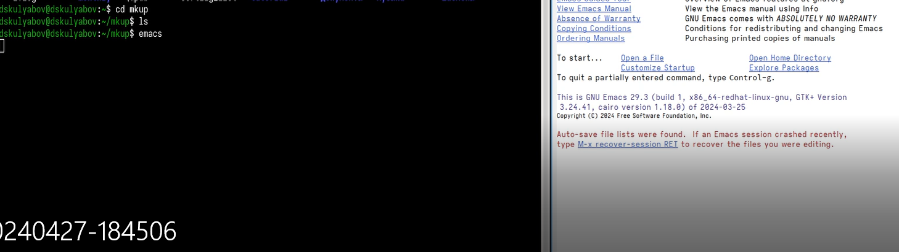

---
## Front matter
title: "Шаблон отчёта по лабораторной работе"
subtitle: "Простейший вариант"
author: "Хань Цзянтао"

## Generic otions
lang: ru-RU
toc-title: "Содержание"

## Bibliography
bibliography: bib/cite.bib
csl: pandoc/csl/gost-r-7-0-5-2008-numeric.csl

## Pdf output format
toc: true # Table of contents
toc-depth: 2
lof: true # List of figures
lot: true # List of tables
fontsize: 12pt
linestretch: 1.5
papersize: a4
documentclass: scrreprt
## I18n polyglossia
polyglossia-lang:
  name: russian
  options:
	- spelling=modern
	- babelshorthands=true
polyglossia-otherlangs:
  name: english
## I18n babel
babel-lang: russian
babel-otherlangs: english
## Fonts
mainfont: PT Serif
romanfont: PT Serif
sansfont: PT Sans
monofont: PT Mono
mainfontoptions: Ligatures=TeX
romanfontoptions: Ligatures=TeX
sansfontoptions: Ligatures=TeX,Scale=MatchLowercase
monofontoptions: Scale=MatchLowercase,Scale=0.9
## Biblatex
biblatex: true
biblio-style: "gost-numeric"
biblatexoptions:
  - parentracker=true
  - backend=biber
  - hyperref=auto
  - language=auto
  - autolang=other*
  - citestyle=gost-numeric
## Pandoc-crossref LaTeX customization
figureTitle: "Рис."
tableTitle: "Таблица"
listingTitle: "Листинг"
lofTitle: "Список иллюстраций"
lotTitle: "Список таблиц"
lolTitle: "Листинги"
## Misc options
indent: true
header-includes:
  - \usepackage{indentfirst}
  - \usepackage{float} # keep figures where there are in the text
  - \floatplacement{figure}{H} # keep figures where there are in the text
---

# Цель работы

Изучить основы программирования в оболочке ОС UNIX/Linux. Научиться писать небольшие командные файлы.
# Задание
1. Ознакомиться с теоретическим материалом.
2. Выполнить упражнения.
4. Ответить на контрольные вопросы.

## Основные термины Emacs


## Выполнение лабораторной работы
 Написать скрипт, который при запуске будет делать резервную копию самого себя (то есть файла, в котором содержится его исходный код) в другую директорию backup в вашем домашнем каталоге. При этом файл должен архивироваться одним из архиваторов на выбор zip, bzip2 или tar. Способ использования команд архивации необходимо узнать, изучив справку.

1. Создать папку backup


2. Откройте emacs



3.  prog1.sh


3. редактор


```
#！/bin/bash

tar  -cvf  ~ /backup/backup.tar prog1.sh


```

5. Запустите код


Написать пример командного файла, обрабатывающего любое произвольное число аргументов командной строки, в том числе превышающее десять. Например, скрипт может последовательно распечатывать значения всех переданных аргументов.

1. Откройте emacs


2. создать  script.sh


3. редактор

```
#！/bin/bash

for  A in $*

​	do echo $A

done
```

4.Запустите код


Написать командный файл — аналог команды ls (без использования самой этой команды и команды dir). Требуется, чтобы он выдавал информацию о нужном каталоге и выводил информацию о возможностях доступа к файлам этого каталога.

1. Откройте emacs


2. создать 


3. редактор


```
#！ /bin/bash

for A in *

do

​	if  test -d  "$A"

​	then

​		echo  "$A^ is a directory"

​	else

​		echo -n "$A: is a file and"

​		if test -w $A

​		then

​				echo wrintable

​						if  test  -r $A

​						then

​								echo "readable"

​						else

​								echo "niether readable or writeable"

​										fi

​									fi

​								fi

done
```

4. Запустите код


Написать командный файл, который получает в качестве аргумента командной строки формат файла (.txt, .doc, .jpg, .pdf и т.д.) и вычисляет количество таких файлов в указанной директории. Путь к директории также передаётся в виде аргумента командной строки.

1. Откройте emacs


2. создать


3. редактор


```
#！/bin/bash

format=" "

directory=""

echo "НАПИШИТЕ ФОРМАТ ФАЙЛА"                                                    // WRITE THE FILE FORMAT

read format

echo "НАПИШИТЕ  ДИРЕКТОРИЮ"													//WRITE THE DIRECTORY

read directory

find "${directory}" -name "*.${format}" -type f | wc -l

ls
```

4. редактор


## Контрольные вопросы
1. Объясните понятие командной оболочки. Приведите примеры командных оболочек. Чем они отличаются? 

   ​	Командная оболочка (или просто оболочка) — это интерфейс между пользователем и операционной системой, который позволяет пользователю взаимодействовать с системой с помощью текстовых команд.

   Примеры командных оболочек:

   1. **Bash (Bourne Again Shell)**: Является стандартной оболочкой в большинстве дистрибутивов Linux и macOS. Она обладает мощными возможностями и широко используется как для рутинных задач, так и для автоматизации.
   2. **Zsh (Z Shell)**: Предоставляет расширенные возможности по сравнению с Bash, такие как автодополнение, темы оформления и другие.
   3. **Fish (Friendly Interactive Shell)**: Отличается от других оболочек своим простым и интуитивно понятным синтаксисом, а также автоматическим автодополнением команд.

   Отличия между ними:

   - **Синтаксис и функциональность**: Каждая оболочка имеет свой собственный синтаксис команд и набор функций.
   - **Продвинутые возможности**: Некоторые оболочки предлагают расширенные функции, такие как автодополнение, подсветка синтаксиса и т. д.
   - **Пользовательский опыт**: Некоторые оболочки стремятся к удобству использования и интуитивному интерфейсу, в то время как другие уделяют больше внимания мощным возможностям и гибкости.

2. Что такое POSIX?

   POSIX (Portable Operating System Interface) - это набор стандартов, разработанных с целью обеспечить совместимость между различными операционными системами UNIX и UNIX-подобными системами. Он определяет интерфейсы программирования приложений (API), команды командной строки и другие системные вызовы. POSIX обеспечивает переносимость программного обеспечения между различными операционными системами, что позволяет программам выполняться на разных платформах без изменений их исходного кода.

3. Как определяются переменные и массивы в языке программирования bash?

   В языке программирования bash переменные определяются путем присваивания значения имени переменной. Например:

   ```
   variable_name=value
   ```

   

4. Каково назначение операторов let и read?

   Оператор `read` используется для считывания ввода пользователя в скриптах bash. Он позволяет прочитать введенное пользователем значение и присвоить его переменной. Например:

   ```
   echo "Enter your name: "
   read name
   echo "Hello, $name!"
   ```

   

5. Какие арифметические операции можно применять в языке программирования bash?

   В языке программирования bash можно выполнять следующие арифметические операции:

   1. **Сложение**: `+`
   2. **Вычитание**: `-`
   3. **Умножение**: `*`
   4. **Деление**: `/`
   5. **Остаток от деления (модуль)**: `%`
   6. **Инкремент**: `++`
   7. **Декремент**: `--`
   8. **Присваивание**: `=`

6. Что означает операция (( ))?

   В языке программирования bash двойные круглые скобки `(( ))` используются для выполнения арифметических операций и сравнений. Внутри двойных круглых скобок можно выполнять арифметические выражения и сравнивать значения.

7. Какие стандартные имена переменных Вам известны? 

   1. **`HOME`**: Содержит путь к домашнему каталогу текущего пользователя.
   2. **`PATH`**: Определяет список каталогов, в которых bash ищет исполняемые файлы.
   3. **`PWD`**: Содержит текущий рабочий каталог.
   4. **`OLDPWD`**: Содержит предыдущий рабочий каталог.
   5. **`USER`**: Имя текущего пользователя.
   6. **`HOSTNAME`**: Имя хоста (компьютера).
   7. **`SHELL`**: Путь к исполняемому файлу оболочки (shell).
   8. **`TERM`**: Указывает тип терминала или эмулятора терминала.
   9. **`UID`**: Числовой идентификатор пользователя.
   10. **`EUID`**: Эффективный числовой идентификатор пользователя.
   11. **`$$`**: PID (идентификатор процесса) текущего скрипта.
   12. **`RANDOM`**: Генерирует случайное число при каждом обращении.
   13. **`?`**: Код возврата последней выполненной команды.
   14. **`IFS`**: Строка символов, используемая в качестве разделителя при разбиении строк на слова.
   15. **`COLUMNS`**: Ширина текущего окна терминала (в символах).
   16. **`LINES`**: Высота текущего окна терминала (в строках).

8. Что такое метасимволы? 

   1. **`\*` (звездочка)**: Подходит к любой последовательности символов.
   2. **`?` (вопросительный знак)**: Подходит к любому одиночному символу.
   3. **`[ ]` (квадратные скобки)**: Подходит к любому символу, указанному внутри квадратных скобок.
   4. **`{ }` (фигурные скобки)**: Используются для создания списка элементов или диапазона.
   5. **`|` (вертикальная черта)**: Используется для объединения команд в команде `pipeline`.
   6. **`$` (доллар)**: Используется для обозначения переменных.
   7. **`\` (обратный слэш)**: Используется для экранирования специальных символов.
   8. **`~` (тильда)**: Обозначает домашний каталог текущего пользователя.

9. Как экранировать метасимволы? 

   Чтобы экранировать метасимволы в оболочке командной строки, используйте обратный слэш (`\`). Например, если вы хотите использовать символ `*` как обычный символ, а не как метасимвол, то напишите его как `\*`.

10. Как создавать и запускать командные файлы?

    1. **Выберите текстовый редактор**: Используйте любой текстовый редактор, такой как Nano, Vim, Notepad (на Windows) или любой другой, который вам нравится.
    2. **Создайте новый файл**: Откройте текстовый редактор и создайте новый файл.
    3. **Напишите команды**: Напишите команды, которые вы хотите выполнить в вашем командном файле. Это могут быть обычные команды оболочки, а также условные операторы, циклы и т. д.
    4. **Сохраните файл**: Сохраните файл с расширением, обычно `.sh` для скриптов оболочки bash, или без расширения.

11. Как определяются функции в языке программирования bash?

    1. **Ключевое слово `function` (необязательно)**: Вы можете использовать ключевое слово `function` перед именем функции, но оно необязательно. Обычно функции определяются просто с их именем.
    2. **Имя функции**: Задайте имя для функции. Имена функций должны быть допустимыми идентификаторами в bash, то есть они должны состоять только из букв, цифр и знаков подчеркивания, и не могут начинаться с цифры.
    3. **Определение функции**: Определите тело функции, заключив его в фигурные скобки `{}`.

12. Каким образом можно выяснить, является файл каталогом или обычным файлом?

     В оболочке командной строки bash можно определить, является ли файл каталогом или обычным файлом, используя команду `test` или ее альтернативу `[ ]` с опцией `-d` для каталога (directory) и опцией `-f` для обычного файла (regular file).

13. Каково назначение команд set, typeset и unset? 

    1. **`set`**: Команда `set` используется для установки или отображения флагов и параметров оболочки. Она позволяет управлять поведением оболочки и выводить текущие настройки. Когда используется без аргументов, `set` отображает список всех установленных параметров и их значений.
    2. **`typeset`**: Команда `typeset` используется для установки атрибутов переменных в оболочке, таких как тип переменной (локальная или глобальная), ее атрибуты (только для чтения, целое число и т. д.), и начальное значение. Это часто используется для определения типов переменных в скриптах bash.
    3. **`unset`**: Команда `unset` используется для удаления переменных или функций в оболочке. Когда вы вызываете `unset` с именем переменной, эта переменная удаляется из окружения оболочки и перестает существовать. Также можно использовать `unset` для удаления функций, передавая ей имя функции.

    Итак, `set` управляет параметрами оболочки, `typeset` управляет атрибутами переменных, а `unset` удаляет переменные или функции.

14. Как передаются параметры в командные файлы? 

    **Позиционные параметры**: Это параметры, передаваемые в командный файл при его вызове. Они могут быть обращены внутри скрипта через специальные переменные `$1`, `$2`, `$3` и так далее, где `$1` соответствует первому параметру, `$2` - второму и так далее

    **Специальные переменные**: В bash есть несколько специальных переменных, которые могут использоваться для доступа к параметрам командной строки. Например, `$0` содержит имя самого скрипта, `$#` содержит количество переданных параметров, а `$@` содержит все параметры в виде списка.

    **Параметры по умолчанию**: Если параметр не передан при вызове скрипта, вы можете использовать значения по умолчанию. 

    **hift**: Команда `shift` используется для смещения позиционных параметров влево. Это может быть полезно, когда вы обработали один параметр и хотите перейти к следующему. 

    

15. Назовите специальные переменные языка bash и их назначение.

    1. **`$0`**: Содержит имя самого скрипта или имя выполняемой команды.
    2. **`$#`**: Содержит количество аргументов (параметров), переданных скрипту или команде.
    3. **`$\*`**: Содержит все аргументы (параметры), переданные скрипту или команде, как единая строка.
    4. **`$@`**: Содержит все аргументы (параметры), переданные скрипту или команде, как список отдельных строк.
    5. **`$?`**: Содержит код завершения последней выполненной команды. Обычно используется для проверки успешности выполнения предыдущей команды (0 - успешно, другие значения - ошибка).
    6. **`$$`**: Содержит идентификатор процесса (PID) текущего скрипта.
    7. **`$!`**: Содержит PID последнего фонового процесса.
    8. **`$IFS`**: Содержит разделители полей, используемые при разбиении строк на слова при выполнении расширения параметров.
    9. **`$OLDPWD`**: Содержит предыдущий рабочий каталог.

# Выводы
